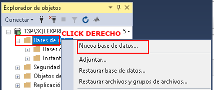
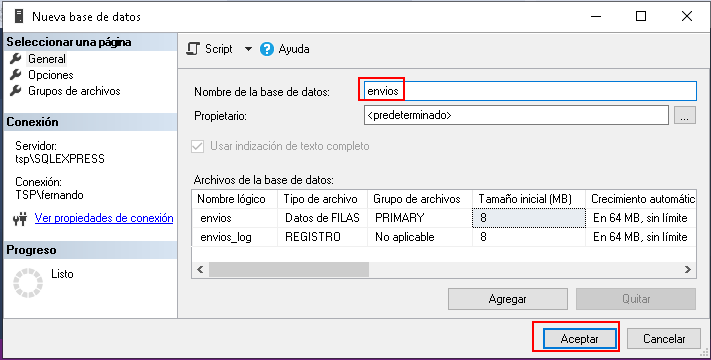
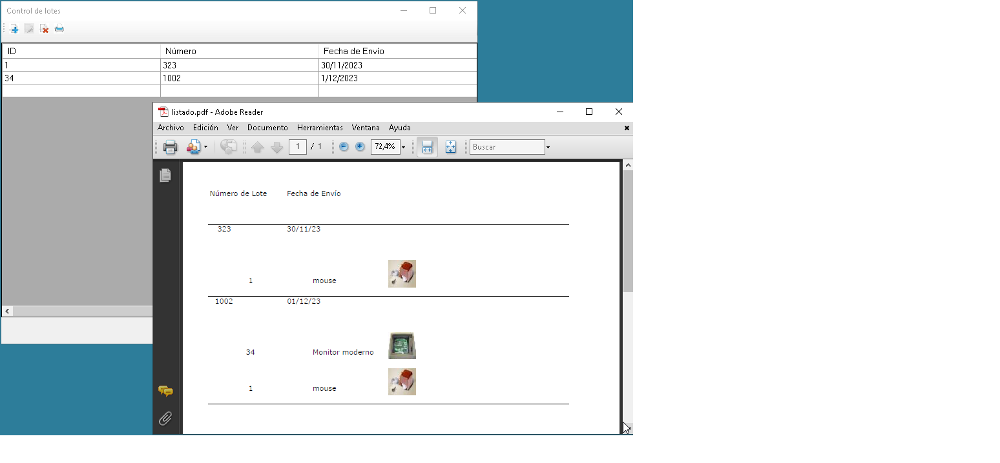

# Ejemplos bases de datos 


###  SqlServer
<details>
<summary>Consultas básicas a SqlServer</summary>

Antes hay que dar de alta la base :
<div align="center">
        
        
        <p>Figura 1. </p>
</div>

Luego hay que correr el ejemplo 1 para crear el esquema. Hay que ajustar la cadena de conexión dependiendo el método de autentificación y el nombre del host. En mi caso es:
```csharp
  string servidor = "TSP\\SQLEXPRESS";            
```
  
</details>

### PostgreSQL
<details>
<summary>Consultas básicas a PostgreSQL</summary>
</details>

### SQLite
<details open>
<summary>Consultas básicas a SQLite</summary>
</details>

### ABM sencillo
<details open>
<summary>Aquí se pone en práctica la idea del patrón DAO</summary>

Es una par de pantallas muy simples que sirven para disparar consultas a la base de datos y mostrar los datos.

#### Configuración de  la base

<div align="center">
        
        <p>Figura 2. </p>
</div>

#### Configuración de  la base
Requiere la creación de la base de datos. Es la misma que se necesitó para los ejemplos anteriores.

Luego hay que configurar la aplicación según la base de datos elegida. 

La configuración se realiza sobre el fichero <a href="EjemplosDaoABM/EjemploABMDesktop/app.config">EjemploABMDesktop/app.config</a> (ajustar con los parámetros propios del entorno a correr)

<details open>
<summary>Para SqlServer configurar con lo siguiente:</summary>
  
```xml
<?xml version="1.0"?>
<configuration>
	<configSections>
     <section name="DatabaseProviderSqlServer" type="System.Configuration.NameValueSectionHandler" />
	</configSections>
	
	<startup>
		<supportedRuntime version="v4.0" sku=".NETFramework,Version=v4.8"/>
	</startup>

	<appSettings>
    <add key="DaoImplLib" value="DaoImplSqlServer" />
		<add key="DaoImplClass" value="DaoImplSqlServer.SqlServerImplDao.GestionEnviosSQLServerImplDao" />
	</appSettings>

	<DatabaseProviderSqlServer>
		<add key="Host" value="TSP\SQLEXPRESS" />
		<add key="Port" value="1433" />
		<add key="BaseDatosNombre" value="envios" />
	</DatabaseProviderSqlServer>

</configuration>       
```

</details>

<details>
<summary>Para PostgreSql configurar con lo siguiente:</summary>

```xml
<?xml version="1.0"?>
<configuration>
	<configSections>
     <section name="DatabaseProviderPostgreSql" type="System.Configuration.NameValueSectionHandler" />
	</configSections>
	
	<startup>
		<supportedRuntime version="v4.0" sku=".NETFramework,Version=v4.8"/>
	</startup>

	<appSettings>
		<add key="DaoImplLib" value="DaoImplPostgreSql" />
		<add key="DaoImplClass" value="DaoImplPostgreSql.PostgreSqlImplDao.GestionEnviosPostgreSqlImplDao" />
	</appSettings>

	<DatabaseProviderPostgreSql>
		<add key="Host" value="localhost" />
		<add key="Port" value="5432" />
		<add key="username" value="postgres" />
		<add key="password" value="postgres" />
		<add key="BaseDatosNombre" value="envios" />
	</DatabaseProviderPostgreSql>

</configuration>       
```
</details>

</details>
